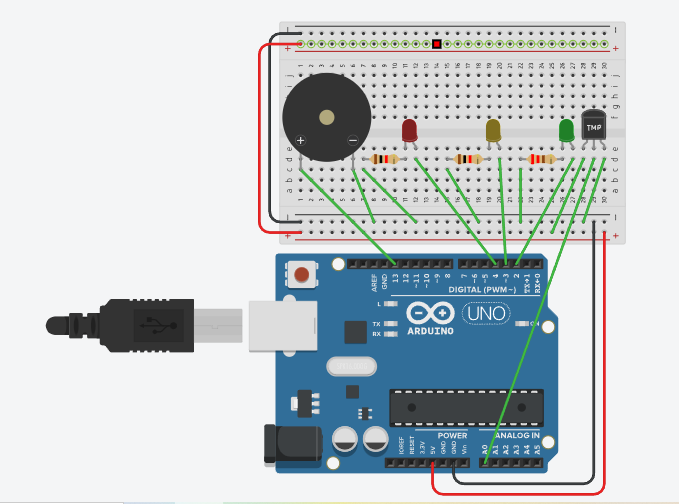

# 🌡️ ThermoSense
# 🌡️ Smart Temperature Monitoring System

A temperature monitoring system built using **Arduino Uno** and simulated on **Tinkercad**.  
The system reads real-time temperature data from a TMP36 sensor and triggers visual and audio alerts based on predefined thresholds.

---

## 📌 Project Overview

This was my first hands-on Arduino project — built entirely on Tinkercad's simulation environment.  
The goal was simple: monitor temperature and give clear, immediate feedback using LEDs and a buzzer.  
What made it valuable wasn't just the output — it was everything I learned while debugging it.

---

## 🛠️ Components Used

| Component | Quantity |
|---|---|
| Arduino Uno | 1 |
| TMP36 Temperature Sensor | 1 |
| Green LED | 1 |
| Yellow LED | 1 |
| Red LED | 1 |
| Piezo Buzzer | 1 |
| 220Ω Resistors | 3 |
| Jumper Wires | As required |
| Breadboard | 1 |

---

## ⚙️ How It Works

The Arduino continuously reads the analog output from the TMP36 sensor and converts it into a temperature value (°C).  
Based on the reading, the system responds as follows:

| Temperature Range | Indicator | Status |
|---|---|---|
| Below 30°C | 🟢 Green LED ON | Normal |
| 30°C – 35°C | 🟡 Yellow LED ON | Warning |
| Above 35°C | 🔴 Red LED ON + Buzzer ON | High Temperature Alert |

I tested all three states by manually adjusting the TMP36 temperature value inside Tinkercad's simulation panel and observing how the LEDs and buzzer responded in real time.

---

## 🖼️ Circuit Diagram

---

## 🐛 Challenges Faced & Debugging Journey

The coding part was straightforward.  
Most of the time — and most of the learning — came from debugging hardware connections.

---

### ❌ Issue 1 — Sensor showing -50°C

The TMP36 kept returning impossible temperature readings.  
After tracing the connections, I found that the sensor wasn't receiving proper power.  
The Arduino's 5V and GND were connected to different power rails than the sensor, so the TMP36 output was effectively reading zero voltage.

**Fix:** Connected the sensor to the correct powered rails. Readings immediately normalized.

---

### ❌ Issue 2 — LEDs not turning on

None of the LEDs were responding despite the code appearing correct.  
The issue was incorrect LED polarity and a missing common ground connection across components.

**Fix:** Corrected LED orientation and ensured all components shared a common ground.

---

### ❌ Issue 3 — Buzzer remaining silent

The buzzer was wired correctly in the code, but the ground connection wasn't properly shared across the circuit.

**Fix:** Once the power rails were properly linked, the buzzer began responding as expected.

---

### ❌ Issue 4 — The Breadboard Rail Mistake *(Biggest Learning)*

This was the most confusing issue of the entire project — and the most valuable lesson.

Since this was my first time working with a breadboard, I assumed the **top and bottom power rails were electrically connected** throughout the board.

So I connected:
- Arduino **5V and GND** → top power rails
- **TMP36 sensor and other components** → bottom power rails

Visually, everything looked perfectly fine. The wires were there. The connections seemed correct.  
But the circuit still wasn't working.

After a lot of troubleshooting, I realized that **on most breadboards, the top and bottom power rails are completely separate** — they are not internally connected to each other.

That meant the sensor wasn't actually receiving power from the Arduino, even though it visually appeared connected.

As soon as I linked the top and bottom rails together using jumper wires, everything changed:
- ✅ Sensor readings started making sense
- ✅ LEDs began responding correctly
- ✅ Buzzer started working

> **Key lesson:** Never assume two points are connected just because they look connected.  
> Always understand how the breadboard is internally wired before building on it.

Ironically, the biggest lesson from this entire project wasn't about coding at all — it was understanding how a breadboard works. 😄

---

## 💡 Learning Outcomes

- Arduino Uno basics and analog pin reading
- TMP36 sensor interfacing and voltage-to-temperature conversion
- Threshold-based control logic
- Circuit debugging — tracing power rails, checking polarity, verifying ground connections
- Understanding breadboard internal wiring (top and bottom rails are separate)
- The importance of systematic debugging over random fixes

---

## 📝 A Personal Note

This was my first Arduino project, and I went in genuinely excited.  
The basics clicked fast — how the Arduino reads sensor values, how code controls physical components.  
But the real learning wasn't from the code. It was from the mistakes.  
The top and bottom power rail confusion was the kind of lesson you only learn by getting it wrong once — and never forgetting it after that.

---

## 🚀 Future Improvements

- Add an LCD display to show live temperature readings
- Replace TMP36 with DHT11 for humidity monitoring as well
- Build the physical circuit on actual hardware instead of simulation
- Add data logging to track temperature over time

---

## 🔧 Simulation Tool

Built and tested on **[Tinkercad](https://www.tinkercad.com/)** — a free browser-based electronics simulation platform.  
No physical hardware required to run this project.

---

## 👤 Author

**Rahil Patel**  
ENC '29 — Thapar Institute of Engineering & Technology  
[LinkedIn](https://www.linkedin.com/in/rahil-patel-59a940383/) | [GitHub](https://github.com/rahilpatel08)

---

*First Arduino project. More coming soon.*
